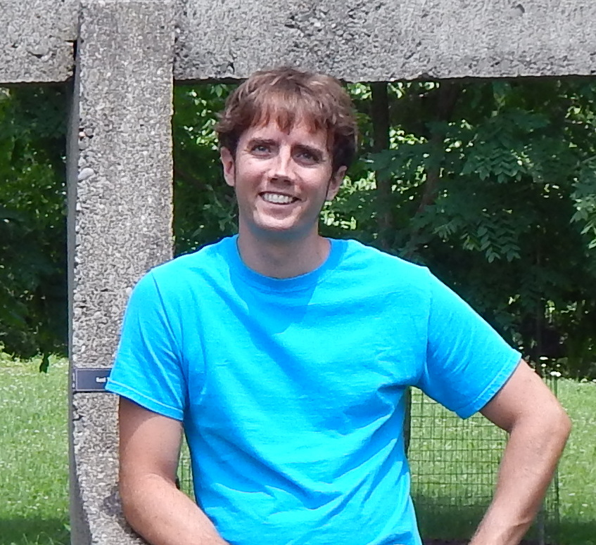

<figure>
  
</figure>

I'm a PhD candidate in Physics at the [University of California, Santa
Cruz][UCSC], advised by [Peter&nbsp;Young][Peter]. My main research focus is
the application of computational methods to the study of disordered systems,
especially [spin glasses][]. Recently I've also been interested in data science
and machine learning and started this blog to share my experiences learning the
tools of the trade.

[UCSC]: http://www.ucsc.edu
[Peter]: http://young.physics.ucsc.edu
[spin glasses]: http://en.wikipedia.org/wiki/Spin_glass
